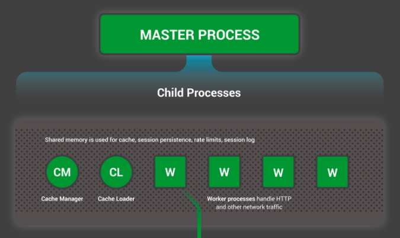
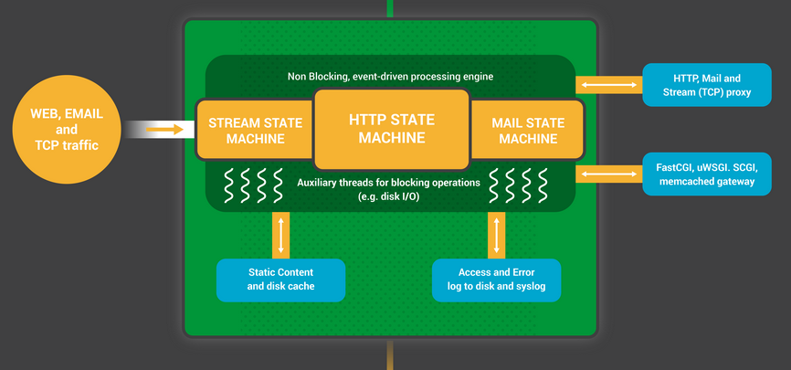
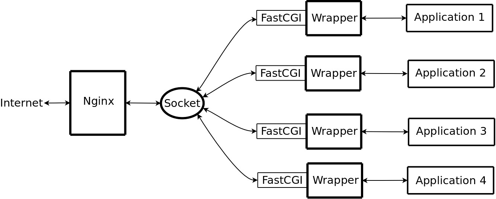

# Nginx Architecture

Notes about nginx , nginx architecture, what is and how FastCGI works and other nginx related concepts.

# Table Of Contents

- **[Introduction](#introduction)**
	-  **[What is Nginx?](#what-is-nginx)**
	- **[Event-Driven Architecture](#event-driven-architecture)**
		- **[What is Event-driver Architecture?](#what-is-event-driver-architecture)**
		- **[What is an event?](#what-is-an-event)**
		- **[How does event-driven architecture work?](#how-does-event-driven-architecture-work)**
- **[Nginx Architecture](#nginx-architecture-1)**
	- **[Overview of nginx Architecture](#overview-of-nginx-architecture)**
	- **[Core Structure](#core-structure)**
	- **[Workers Model](#workers-model)**
	- **[Nginx Process Roles](#nginx-process-roles)**
- **[Nginx FastCGI](#nginx-fastcgi)**
	- **[Introduction](#introduction-1)**
	- **[FastCGI Advantages](#fastcgi-advantages)**
	- **[FastCGI vs CGI Interfaces](#fastcgi-vs-cgi-interfaces)**
	- **[Example ](#example)**

## Introduction

#### What is Nginx?

**_NGINX_** was originally designed as a _web server_ with _high performance_, _reliability_ and low memory usage,  besides being a web server, Nginx also enables _reverse proxying_, _caching_, _load balancing_, and _media streaming_., started as  an attempt to answer the [C10k problem](https://en.wikipedia.org/wiki/C10k_problem). C10k is the challenge of managing ten thousand connections at the same time.

Today, there are even more connections that web servers have to handle. For that reason, NGINX offers a **_single threaded_**, **_event-driven_** and **_asynchronous architecture_**. This feature makes NGINX one of the most reliable servers for speed and scalability.

#### Event-Driven Architecture

###### What is Event-driver Architecture?

Event-driven architecture is a _software architecture_ and model for application design. With an event-driven system, the capture, communication, processing, and persistence of events are the core structure of the solution. This differs from a traditional _request-driven_ model.

Event-driven architecture is defined as a software design pattern in which decoupled applications can **_asynchronously_** publish and subscribe to events via an _event broker_.

By introducing a middleman known as an event broker, event-driven architecture enables what’s called loose coupling of applications, meaning applications and devices don’t need to know where they are sending information, or where information they’re consuming comes from.

**Event-driven architecture** (**EDA**) is a software design pattern that enables an organization to detect “_events_” and act on them in real time or near real time. This pattern replaces the traditional “_request/response_” architecture where services would have to wait for a reply before they could move onto the next task. The flow of event-driven architecture is run by events and it is designed to respond to them or carry out some action in response to an event.

Event-driven architecture is often referred to as “**_asynchronous_**” communication. This means that the sender and recipient don’t have to wait for each other to move onto their next task. Systems are not dependent on that one message.

###### What is an event?

An event is any significant occurrence or change in state for system hardware or software , or more broadly anything that can be noticed and recorded by an application or device, and shared with other applications and devices. All of the things that happen _within_ and _to_ your enterprise are events – customer requests, inventory updates, sensor readings, etc.

###### How does event-driven architecture work?

Event-driven architecture is made up of event producers and event consumers. An event producer detects or senses an event and represents the event as a message. It does not know the consumer of the event, or the outcome of an event. 

After an event has been detected, it is transmitted from the event producer to the event consumers through event channels, where an event processing platform processes the event _asynchronously_. Event consumers need to be informed when an event has occurred. They might process the event or may only be impacted by it. 

The event processing platform will execute the correct response to an event and send the activity downstream to the right consumers. This downstream activity is where the outcome of an event is seen.

**In conclusion** : The components of an event-driven architecture can include three parts: _producer_, _consumer_, _broker_. The broker can be optional, particularly when you have a single producer and a single consumer that are in direct communication with each other and the producer just sends the events to the consumer. An example would be a producer that is sending only to a database or data warehouse so the events are collected and stored for analysis. Most commonly in enterprises, you have multiple sources sending out all types of events with one or more consumers interested in some or all of those events.

## Nginx Architecture 

#### Overview of nginx Architecture

Traditional process- or _thread-based_ models of handling _concurrent connections_ involve handling each connection with a separate process or thread, and blocking on network or input/output operations. Depending on the application, it can be very inefficient in terms of memory and CPU consumption. Spawning a separate process or thread requires preparation of a new runtime environment, including allocation of heap and stack memory, and the creation of a new execution context. Additional CPU time is also spent creating these items, which can eventually lead to poor performance due to thread thrashing on excessive context switching. All of these complications manifest themselves in older web server architectures like Apache's. This is a tradeoff between offering a rich set of generally applicable features and optimized usage of server resources.

From the very beginning, nginx was meant to be a specialized tool to achieve more performance, density and economical use of server resources while enabling dynamic growth of a website, so it has followed a different model. It was actually inspired by the ongoing development of advanced event-based mechanisms in a variety of operating systems. What resulted is a _modular_, _event-driven_, _asynchronous_, _single-threaded_, _non-blocking_ architecture which became the foundation of nginx code (NGINX uses the _master-slave_ design).

nginx uses _multiplexing_ and _event notifications_ heavily, and dedicates specific tasks to separate processes. Connections are processed in a highly efficient run-loop in a limited number of single-threaded processes called `worker`s. Within each `worker` nginx can handle many thousands of concurrent connections and requests per second.

#### Core Structure

NGINX adheres to the master-slave design in the following : 

- **Masters** read and validate configurations by creating, binding, and crossing sockets. They also handle starting, terminations, and maintaining the number of configured worker processes (s_laves_). The master node can also reconfigure the worker process with no service interruption.(reading configuration and binding to ports..)
- **Workers** accept new requests from a shared listen socket and execute highly efficient run loops inside each worker to process thousands of requests. They do all of the work! They handle network connections, read and write content to disk, and communicate with upstream servers.
- **Proxy caches** are special processes. They have a _cache loader_ and _manager_. 
	- The **cache loader** checks the disk cache item and populates the engine’s in-memory database with the cache metadata. It prepares the NGINX instances to work with the files already stored on the disk in a specifically allocated structure. Runs at startup to load the disk‑based cache into memory, and then exits. It is scheduled conservatively, so its resource demands are low.
	- The **cache manager** handles cache expiration and invalidation. Runs periodically and prunes entries from the disk caches to keep them within the configured sizes.

In most cases, the recommended NGINX configuration of one worker process per CPU core makes the most efficient use of hardware resources. It can be customized by setting the worker_processes directive in NGINX configuration.

When the NGINX server is active, only the worker process is busy. Each worker process handles multiple connections in a non-blocking manner, reducing the number of context switches.

Each worker process is single-threaded and runs independently to acquire and process new connections. Processes can communicate using shared memory to obtain shared cache data, session persistent data, and other shared resources.

While handling a variety of actions associated with accepting, processing and managing network connections and content retrieval, nginx uses event notification mechanisms and a number of disk I/O performance enhancements in Linux, Solaris and BSD-based operating systems, like `kqueue`, `epoll`, and `event ports`. The goal is to provide as many hints to the operating system as possible, in regards to obtaining timely asynchronous feedback for inbound and outbound traffic, disk operations, reading from or writing to sockets, timeouts and so on. The usage of different methods for multiplexing and advanced I/O operations is heavily optimized for every Unix-based operating system nginx runs on.

Nginx uses an asynchronous, non-blocking event handling mechanism. Specific to system calls like `Select/poll/epoll/kqueue`. This mechanism solves both problems with blocking and non-blocking mechanisms (constant checking). 

#### Workers Model

As previously mentioned, nginx doesn't spawn a process or thread for every connection. Instead, `worker` processes accept new requests from a shared "listen" socket and execute a highly efficient run-loop inside each `worker` to process thousands of connections per `worker`. There's no specialized arbitration or distribution of connections to the `worker`s in nginx; this work is done by the OS kernel mechanisms. Upon startup, an initial set of listening sockets is created. `worker`s then continuously accept, read from and write to the sockets while processing HTTP requests and responses.

The run-loop is the most complicated part of the nginx `worker` code. It includes comprehensive inner calls and relies heavily on the idea of asynchronous task handling. Asynchronous operations are implemented through modularity, event notifications, extensive use of callback functions and fine-tuned timers. Overall, the key principle is to be as non-blocking as possible. The only situation where nginx can still block is when there's not enough disk storage performance for a `worker` process.

Because nginx does not fork a process or thread per connection, memory usage is very conservative and extremely efficient in the vast majority of cases. nginx conserves CPU cycles as well because there's no ongoing create-destroy pattern for processes or threads. What nginx does is check the state of the network and storage, initialize new connections, add them to the run-loop, and process asynchronously until completion, at which point the connection is deallocated and removed from the run-loop. Combined with the careful use of `syscall`s and an accurate implementation of supporting interfaces like pool and slab memory allocators, nginx typically achieves moderate-to-low CPU usage even under extreme workloads.

Because nginx spawns several `worker`s to handle connections, it scales well across multiple cores. Generally, a separate `worker` per core allows full utilization of multicore architectures, and prevents thread thrashing and lock-ups. There's no resource starvation and the resource controlling mechanisms are isolated within single-threaded `worker` processes. This model also allows more scalability across physical storage devices, facilitates more disk utilization and avoids blocking on disk I/O. As a result, server resources are utilized more efficiently with the workload shared across several workers.

With some disk use and CPU load patterns, the number of nginx `worker`s should be adjusted. The rules are somewhat basic here, and system administrators should try a couple of configurations for their workloads. General recommendations might be the following: if the load pattern is CPU intensive—for instance, handling a lot of TCP/IP, doing SSL, or compression—the number of nginx `worker`s should match the number of CPU cores; if the load is mostly disk I/O bound—for instance, serving different sets of content from storage, or heavy proxying—the number of `worker`s might be one and a half to two times the number of cores. Some engineers choose the number of `worker`s based on the number of individual storage units instead, though efficiency of this approach depends on the type and configuration of disk storage.

One major problem that the developers of nginx will be solving in upcoming versions is how to avoid most of the blocking on disk I/O. At the moment, if there's not enough storage performance to serve disk operations generated by a particular `worker`, that `worker` may still block on reading/writing from disk. A number of mechanisms and configuration file directives exist to mitigate such disk I/O blocking scenarios. Most notably, combinations of options like sendfile and AIO typically produce a lot of headroom for disk performance. An nginx installation should be planned based on the data set, the amount of memory available for nginx, and the underlying storage architecture.

Each NGINX worker process is initialized with the NGINX configuration and is provided with a set of listen sockets by the master process.

The NGINX worker processes begin by waiting for events on the listen sockets `accept_mutex` and `kernel socket sharding`. Events are initiated by new incoming connections. These connections are assigned to a _state machine_ – the HTTP state machine is the most commonly used, but NGINX also implements state machines for stream (raw TCP) traffic and for a number of mail protocols (SMTP, IMAP, and POP3).

The state machine is a collection of instructions that tells NGINX how to handle a request. The state machine used by most web servers that perform the same duties as NGINX is similar; the difference is in the implementation.

#### Nginx Process Roles

nginx runs several processes in memory; there is a single master process and several `worker` processes. There are also a couple of special purpose processes, specifically a cache loader and cache manager. All processes are single-threaded in version 1.x of nginx. All processes primarily use shared-memory mechanisms for inter-process communication. The master process is run as the `root` user. The cache loader, cache manager and `worker`s run as an unprivileged user.

The master process is responsible for the following tasks:

- reading and validating configuration
- creating, binding and closing sockets
- starting, terminating and maintaining the configured number of `worker` processes
- reconfiguring without service interruption
- controlling non-stop binary upgrades (starting new binary and rolling back if necessary)
- re-opening log files
- compiling embedded Perl scripts

The `worker` processes accept, handle and process connections from clients, provide reverse proxying and filtering functionality and do almost everything else that nginx is capable of. In regards to monitoring the behavior of an nginx instance, a system administrator should keep an eye on `worker`s as they are the processes reflecting the actual day-to-day operations of a web server.

The cache loader process is responsible for checking the on-disk cache items and populating nginx's in-memory database with cache metadata. Essentially, the cache loader prepares nginx instances to work with files already stored on disk in a specially allocated directory structure. It traverses the directories, checks cache content metadata, updates the relevant entries in shared memory and then exits when everything is clean and ready for use.

The cache manager is mostly responsible for cache expiration and invalidation. It stays in memory during normal nginx operation and it is restarted by the master process in the case of failure.

## Nginx FastCGI

#### Introduction 

Nginx can proxy requests using http, FastCGI, uwsgi, SCGI, or memcached. We will discuss FastCGI proxying, which is one of the most common proxying protocols.

Fast Common Gateway Interface (FastCGI) is a **standard protocol** for interfacing external applications to Web servers. It is a feature-enhanced version of the existing standard Common Gateway Interface (CGI). FastCGI remains the preferred choice over CGI and other proprietary server application programming interfaces (APIs) because its features are fast, open and maintainable.

Unlike CGI, FastCGI does not create a new process for each request, thus minimizing the overhead of process creation and destruction each time a request is received. This overhead can be circumvented by using Application Program Interfaces (APIs),  but because these are proprietary, there are an additional learning curve and limitations in supported languages to be considered. Another shortcoming of CGI is the fact that certain cases for reuse can not be obtained, such as connections to databases or caching techniques. Request handling can be as much as 30 times faster using FastCGI over conventional CGI.

With FastCGI, multiple requests can be handled over a single connection, which is known as multiplexing. Alternatively, multiple connections can be used. Requests are transmitted using File Transfer Protocol (FTP) or sockets. The same connection is then used to return the response.

Although the connection might be closed at this point, the web server and the process still persist. This offers many advantages. For example, it means that the server and application process can be shut down or restarted separately.

#### FastCGI Advantages

The FastCGI interface combines the best aspects of CGI and vendor APIs. Like CGI, FastCGI applications run in separate, isolated processes. FastCGI’s advantages include:

- **Performance.** FastCGI processes are persistent-they are reused to handle multiple requests. This solves the CGI performance problem of creating new processes for each request.
- **Simplicity, with easy migration from CGI.** The FastCGI application library (described on page 9) simplifies the migration of existing CGI applications. Applications built with the application library can also run as CGI programs, for backward compatibility with old Web servers.
- **Language independence.** Like CGI, FastCGI applications can be written in any language, not just languages supported by the vendor API.
- **Process isolation.** A buggy FastCGI application cannot crash or corrupt the core server or other applications. A malicious FastCGI application cannot steal any secrets (such as session keys for encryption) from the Web server.
- **Non-proprietary.** FastCGI is supported in all of Open Market’s server products, and support is under development for other Web servers, including the freely available Apache and NCSA servers, as well as commercial servers from Microsoft and Netscape.
- **Architecture independence.** The FastCGI interface is not tied to a particular server architecture. Any Web server can implement the FastCGI interface. Also, FastCGI does not impose any architecture on the application: applications can be single or multi-threaded, regardless of the threading architecture of the Web server.
- **Support for distributed computing.** FastCGI provides the ability to run applications remotely, which is useful for distributing load and managing external Web sites.

**Note** :
FastCGI seems like the solution for all Web server issues. However, its applications have disadvantages, including:

- Memory leaks may occur because FastCGI applications do not terminate after each Web server request.
- Although FastCGI supports process isolation, it does not support request isolation. FastCGI applications handle complex multiple requests simultaneously. Thus, rather than isolating the defective request, all other requests also crash.
- Writing multiplexing FastCGI applications is complex and time-consuming.

#### FastCGI vs CGI Interfaces

The functionality provided by the FastCGI interface is very similar to that provided by CGI. To best understand the FastCGI protocol, we review the CGI interface here. Basic CGI request processing proceeds as follows:

1. For each request, the server creates a new process and the process initializes itself.
2. The Web server passes the request information (such as remote host, username, HTTP headers, etc.) to the CGI program in environment variables.
3. The Web server sends any client input (such as user-entered field values from an HTML form) to the CGI program’s standard input.
4. The CGI program writes any output to be returned to the client on standard output. Error information written to standard error is logged by the Web server.
5. When the CGI process exits, the request is complete.

FastCGI is conceptually very similar to CGI, with two major differences:

- FastCGI processes are persistent: after finishing a request, they wait for a new request instead of exiting.
- Instead of using operating system environment variables and pipes, the FastCGI protocol multiplexes the environment information, standard input, output and error over a single full-duplex connection. This allows FastCGI programs to run on remote machines, using TCP connections between the Web server and the FastCGI application.

Request processing in a single-threaded FastCGI application proceeds as follows:

1. The Web server creates FastCGI application processes to handle requests. The processes may be created at startup, or created on demand.
2. The FastCGI program initializes itself, and waits for a new connection from the Web server.
3. When a client request comes in, the Web server opens a connection to the FastCGI process. The server sends the CGI environment variable information and standard input over the connection.
4. The FastCGI process sends the standard output and error information back to the server over the same connection.
5. When the FastCGI process closes the connection, the request is complete. The FastCGI process then waits for another connection from the Web server.

FastCGI applications can run locally (on the same machine as the Web server) or remotely. For local applications, the server uses a full-duplex pipe to connect to the FastCGI application process. For remote applications, the server uses a TCP connection.

FastCGI applications can be single-threaded or multi-threaded. For single threaded applications, the Web server maintains a pool of processes (if the application is running locally) to handle client requests. The size of the pool is user configurable. Multi-threaded FastCGI applications may accept multiple connections from the Web server and handle them simultaneously in a single process. (For example, Java’s built-in multi-threading, garbage collection, synchronization primitives, and platform independence make it a natural implementation language for multi-threaded FastCGI applications.)

#### Example 

One of the main use-cases of FastCGI proxying within Nginx is for PHP processing. Unlike Apache, which can handle PHP processing directly with the use of the `mod_php` module, Nginx must rely on a separate PHP processor to handle PHP requests. Most often, this processing is handled with `php-fpm`, a PHP processor that has been extensively tested to work with Nginx.

Nginx with FastCGI can be used with applications using other languages so long as there is an accessible component configured to respond to FastCGI requests.

##### [References]
- [https://www.nginx.com/blog/inside-nginx-how-we-designed-for-performance-scale/](https://www.nginx.com/blog/inside-nginx-how-we-designed-for-performance-scale/)
- [https://aosabook.org/en/v2/nginx.html](https://aosabook.org/en/v2/nginx.html)
- [https://github.com/FastCGI-Archives](https://github.com/FastCGI-Archives)