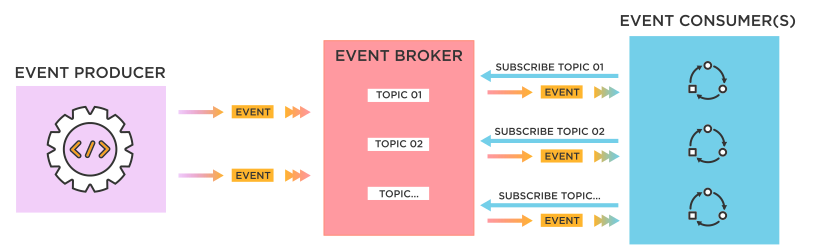

# Nginx Architecture

Notes about nginx , nginx architecture, what is and how FastCGI works and other nginx related concepts.

## Introduction

#### What is Nginx?

**_NGINX_** was originally designed as a _web server_ with _high performance_, _reliability_ and low memory usage,  besides being a web server, Nginx also enables _reverse proxying_, _caching_, _load balancing_, and _media streaming_., started as  an attempt to answer the [C10k problem](https://en.wikipedia.org/wiki/C10k_problem). C10k is the challenge of managing ten thousand connections at the same time.

Today, there are even more connections that web servers have to handle. For that reason, NGINX offers a **_single threaded_**, **_event-driven_** and **_asynchronous architecture**_. This feature makes NGINX one of the most reliable servers for speed and scalability.

#### Event-Driven Architecture

###### What is Event-driver Architecture?

Event-driven architecture is a _software architecture_ and model for application design. With an event-driven system, the capture, communication, processing, and persistence of events are the core structure of the solution. This differs from a traditional _request-driven_ model.

Event-driven architecture is defined as a software design pattern in which decoupled applications can **_asynchronously_** publish and subscribe to events via an _event broker_.

By introducing a middleman known as an event broker, event-driven architecture enables what’s called loose coupling of applications, meaning applications and devices don’t need to know where they are sending information, or where information they’re consuming comes from.

**Event-driven architecture** (**EDA**) is a software design pattern that enables an organization to detect “_events_” and act on them in real time or near real time. This pattern replaces the traditional “_request/response_” architecture where services would have to wait for a reply before they could move onto the next task. The flow of event-driven architecture is run by events and it is designed to respond to them or carry out some action in response to an event.

Event-driven architecture is often referred to as “**_asynchronous_**” communication. This means that the sender and recipient don’t have to wait for each other to move onto their next task. Systems are not dependent on that one message.

##### What is an event?

An event is any significant occurrence or change in state for system hardware or software , or more broadly anything that can be noticed and recorded by an application or device, and shared with other applications and devices. All of the things that happen _within_ and _to_ your enterprise are events – customer requests, inventory updates, sensor readings, etc.

#### Asynchronous Architecture